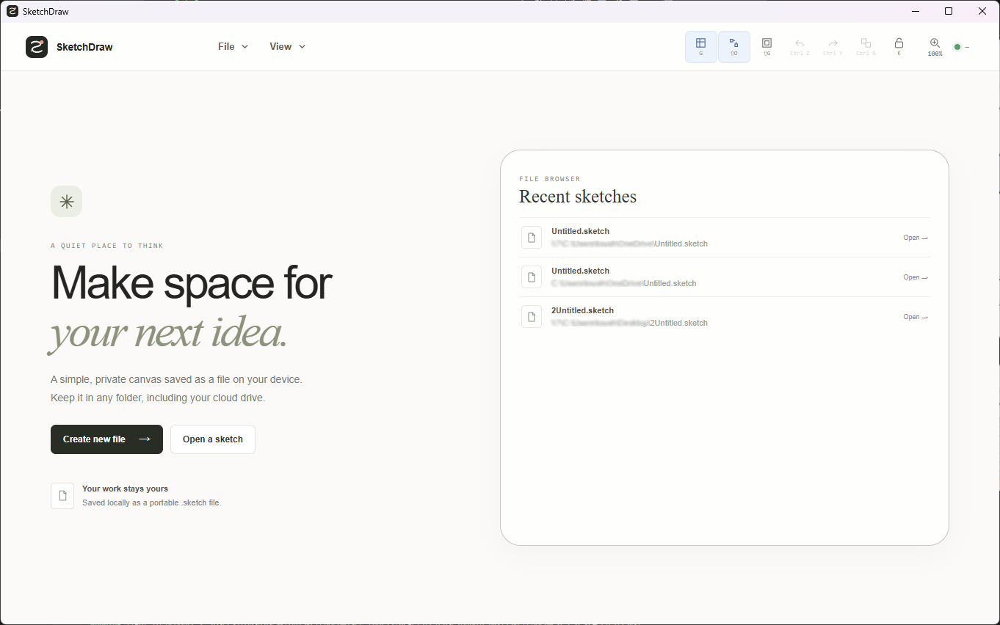
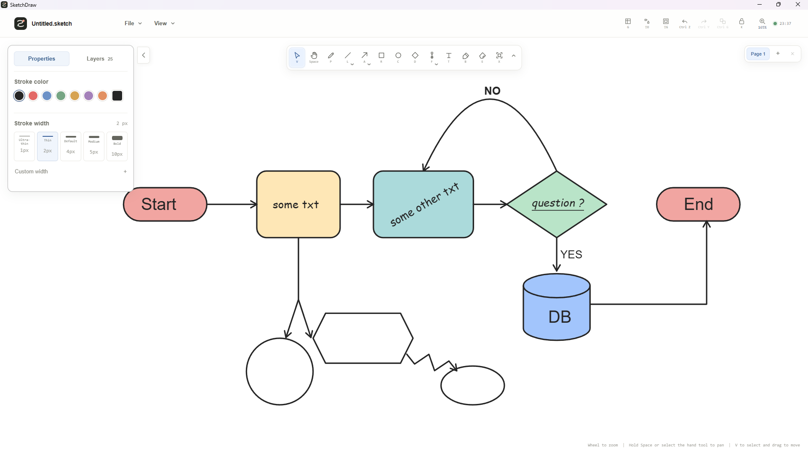

# SketchDraw

SketchDraw is a local-first desktop whiteboard for flowcharts, diagrams, and visual notes. Each project is a portable `.sketch` file you choose where to save. Keep it on your computer or in a folder managed by OneDrive, iCloud Drive, Dropbox, Google Drive, or another sync service.

**Current release: 0.2.1 · Document format: version 5**

> Version 0.2.1 opens and saves only version 5 `.sketch` documents. Older SketchDraw formats and `.sketchdraw` files are unsupported; changing a file extension does not convert a document.

Try the [sample flowchart](docs/examples/getting-started.sketch) to explore attached connectors, labels, and multiple pages.

## Screenshots



*Launch screen with file actions and recent sketches.*



*Canvas workspace showing editable flowchart shapes, attached arrows, pages, and style controls.*


*Connector routes and line styles. This is a feature illustration, not an application screenshot.*

## Features

- **File-based projects:** Create, open, and automatically save version 5 `.sketch` files. Native saves write a temporary file beside the destination before replacing it. Up to eight recent file paths are remembered on the device.
- **Drawing tools:** Freehand pen, line, arrow, rectangle, circle, diamond, flowchart symbols, text, fill bucket, eraser, and image import/cropping.
- **Flowchart symbols:** Process, Terminator, Decision, Input/Output, Document, Database, Predefined Process, Preparation, Manual Input, On-page Connector, Off-page Connector, Delay, Manual Operation, and Stored Data.
- **Connectors:** Straight or curved lines; straight, elbow, forked, loop, and jagged arrows; solid, dashed, dotted, or double strokes; configurable arrowheads; shape attachment points; and editable connector routes.
- **Object editing:** Select, move, resize, rotate, group, copy, cut, paste, duplicate, align, distribute, and reorder objects. Lock or hide layers, use precision controls, and access commands from the right-click menu.
- **Canvas controls:** Pan and zoom, fit the drawing, zoom to selection, use a grid, snap to grid or nearby objects, and lock the canvas against edits.
- **Text and images:** Text starts at 16px. Shape labels support font and color, bold, italic, underline, lists, horizontal and vertical alignment, and wrapping. Imported images are embedded in the project file.
- **Pages and history:** Add, rename, duplicate, reorder, and delete pages. Undo and redo history is maintained per page during the session.
- **Recovery and conflict checks:** Unsaved work is recoverable from local app storage. Before autosaving, SketchDraw checks for external changes to the open file and offers conflict choices.
- **Export:** Export the current page, selected objects, or the visible canvas as PNG, SVG, or PDF. Choose output dimensions and grid inclusion; PNG and SVG support transparent backgrounds. PDF export is a raster snapshot.
- **Themes:** Follow the system light/dark appearance or choose a theme and canvas color.

## File format

SketchDraw uses a JSON-based **version 5** format in `.sketch` files. Older versions, `.sketchdraw` files, and unrelated files with a `.sketch` extension are rejected. Renaming an old file does not convert it. See the [version 5 format reference](docs/file-format-v5.md).

Cloud synchronization is performed by the provider you choose, not by SketchDraw. Conflict checks reduce accidental overwrites but do not provide distributed locking; avoid editing the same file simultaneously on multiple devices.

## Download and install

Windows installers are unsigned. The package metadata names **Toushal Sampat** as publisher, but that metadata does not authenticate the installer. Windows may show a SmartScreen warning for an unrecognized download. If you choose to proceed, review the source and file, then use Windows' **Run anyway** option where it is offered. This is an unsigned manual distribution; no signing credentials or signing step are required to build it.

For the current Windows x64 NSIS installer, see the [0.2.1 release guide](docs/release-0.2.1.md). It includes the build command and output path.

## Build from source

### Requirements

- Node.js and npm
- Rust toolchain
- Tauri v2 system dependencies for your operating system

See the [Tauri prerequisites](https://v2.tauri.app/start/prerequisites/) for platform-specific setup.

### Run the desktop app

```sh
npm ci
npm run tauri -- dev
```

Build the frontend with `npm run build`, or create a desktop bundle with:

```sh
npm run tauri -- build
```

To build the Windows x64 NSIS installer:

```powershell
npm run tauri -- build --bundles nsis
```

The bundle metadata identifies **Toushal Sampat** as publisher. The current build configuration produces unsigned installers and uses no signing certificate or signing step.

## Keyboard shortcuts

| Shortcut | Action |
| --- | --- |
| `V` | Select tool |
| `P` | Pen |
| `R` | Rectangle |
| `C` or `O` | Circle |
| `D` | Diamond |
| `L` | Line |
| `A` | Arrow |
| `F` | Flowchart symbols |
| `T` | Text |
| `B` | Fill bucket |
| `E` | Eraser |
| `X` | Image crop |
| Hold `Space` | Temporarily pan the canvas |
| `G` | Toggle grid |
| `Shift+G` | Toggle grid snapping |
| `Shift+O` | Toggle object snapping |
| `K` | Lock or unlock the canvas |
| `0` | Reset zoom and center view |
| `1` / `2` | Fit drawing / zoom to selection |
| `Ctrl/Cmd+C`, `X`, `V` | Copy, cut, paste objects |
| `Ctrl/Cmd+D` | Duplicate selection |
| `Ctrl/Cmd+A` | Select all visible, unlocked objects |
| Arrow keys / `Shift`+Arrow | Nudge selection by 1 / 10 units |
| `Ctrl/Cmd+N` | New document |
| `Ctrl/Cmd+O` | Open document |
| `Ctrl/Cmd+S` | Save document |
| `Ctrl/Cmd+Z` | Undo |
| `Ctrl/Cmd+Y` or `Ctrl/Cmd+Shift+Z` | Redo |
| `Ctrl/Cmd+G` | Group selected objects |
| `Ctrl/Cmd+Shift+G` | Ungroup selection |
| `Escape` | Return to Select and clear selection |

## License

SketchDraw is distributed under the [End User License Agreement](LICENSE), not an open-source license. You retain rights to the drawings and files you create. The EULA describes the terms for using and distributing the application.

## Privacy and local data

SketchDraw has no account system, analytics, telemetry, or application service that uploads documents. The app uses Tauri's local filesystem and dialog APIs to open and save files selected by you. It does not send drawing content to SketchDraw servers.

Some app data is kept in local WebView storage on this device:

- Up to eight recent `.sketch` file paths, to populate the launch screen.
- A theme preference.
- A recovery snapshot for an open document when it has unsaved changes. Recovery data is removed after the document is saved or recovery is discarded; if neither happens, it remains in local app storage.

The recovery snapshot can contain the document's text, shapes, and embedded image data. It is stored locally so an interrupted session can be recovered. Other apps or accounts on this device may have access according to the operating system's user-account and device security.

If you save a project inside a cloud-sync folder, that folder's provider may upload and process the file under its own terms and settings. SketchDraw does not control that service. Exported files are written to the location you choose. The installer and operating system also have their own download, security, and update behavior; this project does not receive those reports.

This description is not a legal certification for every jurisdiction or distribution setup. Data protection obligations can include transparency, purpose limitation, data minimization, retention, and security requirements.