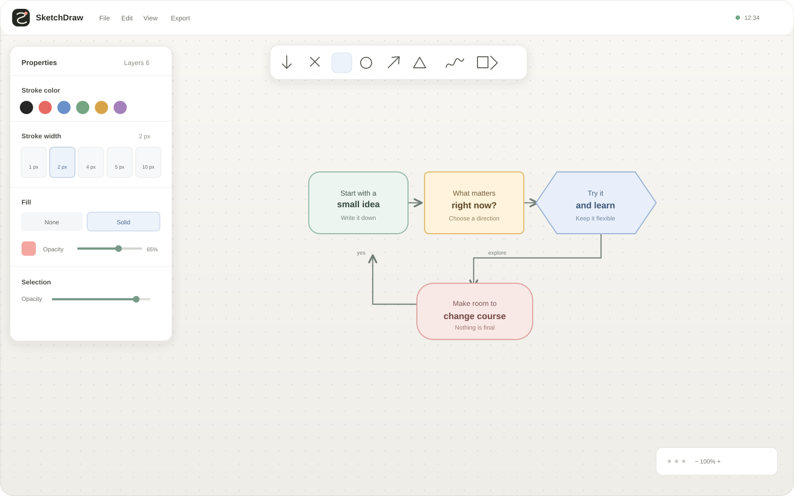
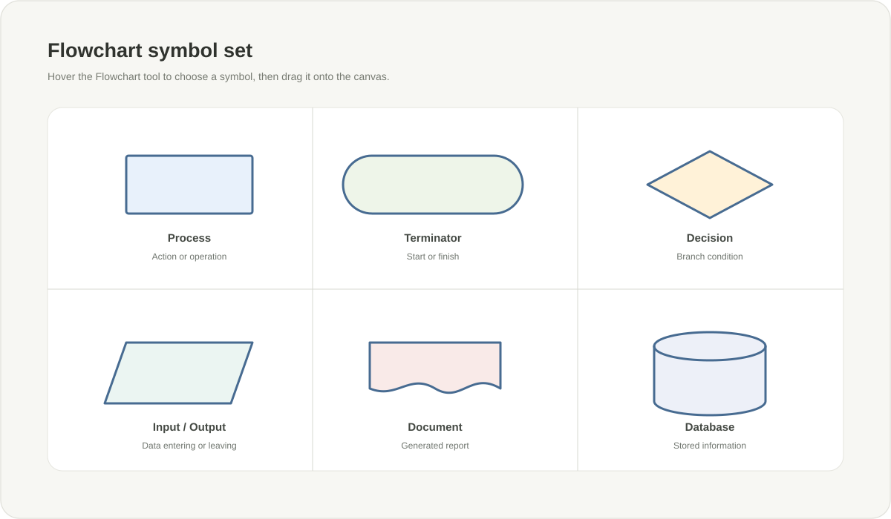
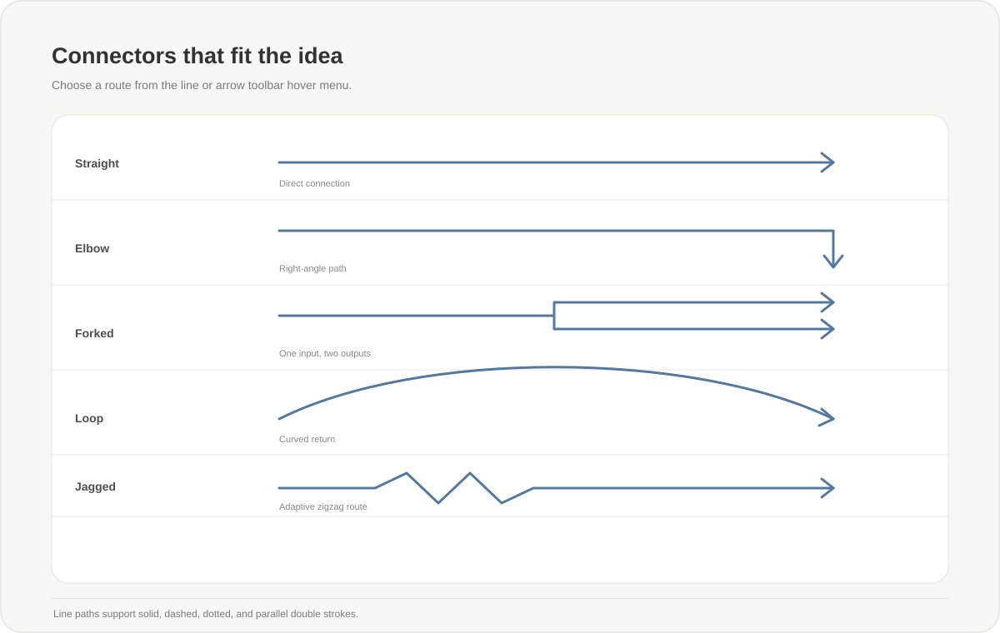

# SketchDraw

`AI made`

`Windows Build Only`

SketchDraw is a desktop whiteboard for diagrams, plans, and visual notes. Drawings are stored as versioned `.sketch` files on your device. Save a file in a OneDrive, iCloud Drive, Dropbox, Google Drive, or other synced folder to let that service synchronize it across devices. SketchDraw does not require an account or act as a cloud storage service.

## Preview

These project illustrations show the workspace and selected tool options. They are SVG previews, not captures of a running build.

### Workspace



### Flowchart symbols



### Lines and arrows



## Features

- **Local documents:** Create, open, and automatically save version 4 `.sketch` documents. Older document formats and other extensions are not supported. Documents are JSON files and can be placed in a locally synchronized folder. The launch screen keeps a list of up to eight recent files.
- **Drawing tools:** Freehand pen, rectangle, circle, diamond, line, arrow, flowchart symbol, and editable text tools.
- **Flowchart symbols:** Process, Terminator, Decision, Input/Output, Document, Database, Predefined Process, Preparation, and Manual Input.
- **Lines and arrows:** Straight and curved lines; straight, elbow, forked, loop, and jagged arrows; solid, dashed, dotted, and double strokes; independently configurable arrowheads on either end.
- **Style controls:** Stroke and fill colors, opacity, thickness, shape corners, text font and formatting, and connector settings.
- **Object editing:** Select, move, resize, rotate, group, and change the stacking order of objects. The layer panel can hide or lock individual elements.
- **Canvas navigation:** Pan and zoom, toggle the grid, snap to the grid or nearby objects, and use alignment guides. The canvas can be locked against drawing and editing.
- **Text and images:** Add formatted text with bold, italic, underline, alignment, and lists. Import and crop images; imported image data is embedded in the document.
- **Pages and history:** Keep multiple pages in one file and undo or redo edits.
- **Recovery and sync conflicts:** SketchDraw keeps a local recovery copy of unsaved edits and checks for external file changes before overwriting a document during autosave.
- **Export:** Export the current view as SVG, PNG, or PDF. PNG and PDF exports support custom dimensions; PNG can have a transparent background. PDF output is a raster snapshot.
- **Themes:** Follow the system light/dark theme or choose a theme and whiteboard color.

## File format

SketchDraw creates and opens `.sketch` files using its version 4 JSON format. Older versions and other file extensions are rejected. Imported images are stored inside the document. To use cloud sync, save the file inside a folder managed by your preferred sync provider; synchronization is handled by that provider.

## Development

### Requirements

- Node.js and npm
- Rust toolchain
- Tauri v2 system dependencies for your operating system

See the [Tauri prerequisites](https://v2.tauri.app/start/prerequisites/) for platform-specific setup.

### Run the desktop app

```sh
npm install
npm run tauri -- dev
```

Build the frontend with `npm run build`, or create a desktop bundle with:

```sh
npm run tauri -- build
```

### Project structure

```text
src/                  SolidJS interface and HTML canvas engine
src-tauri/            Tauri v2 backend, permissions, and native app icons
icons/                SketchDraw SVG logo artwork
docs/screenshots/     SVG previews used in this README
```

## Keyboard shortcuts

| Shortcut | Action |
| --- | --- |
| `V` | Select tool |
| `P` | Pen |
| `R` | Rectangle |
| `C` or `O` | Circle |
| `D` | Diamond |
| `L` | Line |
| `A` | Arrow |
| `F` | Flowchart symbols |
| `T` | Text |
| `B` | Fill bucket |
| `E` | Eraser |
| `X` | Image crop |
| Hold `Space` | Temporarily pan the canvas |
| `G` | Toggle grid |
| `Shift+G` | Toggle grid snapping |
| `Shift+O` | Toggle object snapping |
| `K` | Lock or unlock the canvas |
| `0` | Reset zoom and center the drawing |
| `Ctrl/Cmd+N` | New document |
| `Ctrl/Cmd+O` | Open document |
| `Ctrl/Cmd+S` | Save document |
| `Ctrl/Cmd+Z` | Undo |
| `Ctrl/Cmd+Y` or `Ctrl/Cmd+Shift+Z` | Redo |
| `Ctrl/Cmd+G` | Group selected objects |
| `Ctrl/Cmd+Shift+G` | Ungroup selection |
| `Escape` | Return to Select and clear selection |

## End User License Agreement

SketchDraw is distributed under this End User License Agreement (EULA), not an open-source license.

### License grant

You may install and use SketchDraw on your devices for personal or internal business purposes. You may not redistribute, sublicense, sell, or reverse-engineer the software.

### Ownership

SketchDraw and its related materials remain the property of the copyright holder. This license does not transfer ownership rights.

### Your content

You retain all rights to drawings and files you create. SketchDraw does not claim ownership of your `.sketch` documents or their contents.

### No warranty

SketchDraw is provided "as is," without warranties of any kind. Use it at your own risk.

### Limitation of liability

The copyright holder is not liable for damages arising from the use or inability to use SketchDraw.

### Termination

This license ends if you breach its terms. Upon termination, you must stop using and delete all copies of the software.

By using SketchDraw, you agree to these terms.
